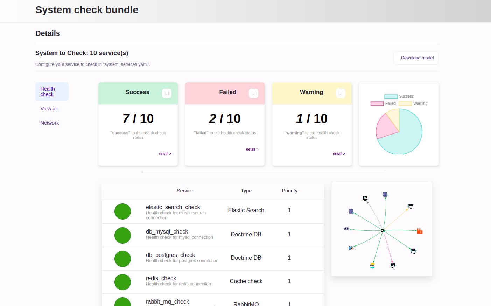
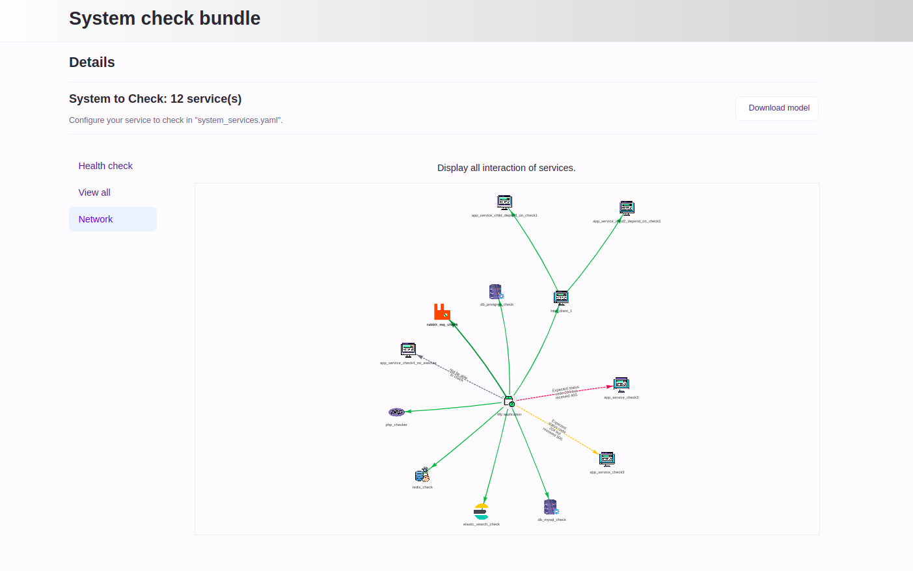
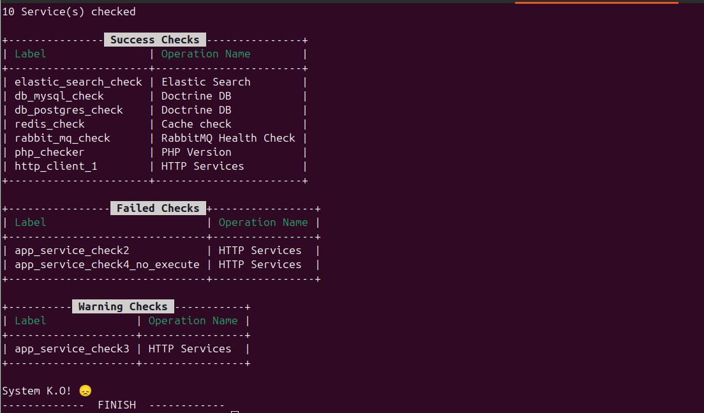

# SystemCheckBundle 📊

> A Symfony bundle compatible with PHP 7.2+ | 8.* and Symfony 3.4 (⚠️ some error will be fix) | 4.* | 5.* | 6.* | 7.* that provides default checks for your services and connections (database, HTTP client, RabbitMQ, cache...) along with custom checks.



## 🚀 Installation

1. **Configure `composer.json`**  
   Add this repository to the `repositories` section of your `composer.json` file:

   ```json
   "repositories": [
       {
           "type": "vcs",
           "url": "https://github.com/tax16/SystemCheckBundle.git"
       }
   ]
   ```
2. **Add the bundle via Composer**  
   Run the following command in your terminal:

   ```bash
   composer require tax16/system-check-bundle
   ```


3. **Initialize the bundle**  
   After installation, run the following command:

   ```bash
   php bin/console system-check:init
   ```

4. **Update twig.yaml**  
   If you want to use the UI, you need to add this path on the packages/twig.yaml

   ```yaml
   twig:
        # other path
       paths:
         '%kernel.project_dir%/vendor/tax16/system-check-bundle/src/UserInterface/Resources/views': SystemCheckBundle
   ```
5.**Update routes.yaml**  
   If you want to use the UI, you need to add this path on the packages/twig.yaml

   ```yaml
    system_check_bundle:
      resource: '@SystemCheckBundle/Infrastructure/Resources/config/routes.yaml'
   ```

6. **Access the System Check page**  
   After initialization, you can access the system check page at `/system-check/index`.

   ⚠️ *Note*: Make sure to review any security restrictions on your URLs.

## ⚙️ Features

- **Default Checks**:
    - Database connection
    - HTTP client connectivity
    - RabbitMQ connectivity
    - Cache service status
    - Php version
    - Elastic search

- **Custom Checks**  
  You can add custom checks tailored to your application requirements by implementing `Tax16\SystemCheckBundle\Core\Domain\Service\ServiceCheckInterface`, After add tags: label, name and priority like on the Usage.
## 🔧 Usage

To configure custom checks, define them in `config/packages/system_services.yaml`. Below is an example configuration for a custom HTTP service check:
- Example of file: [Download the file](doc/example/system_services.yaml)
```yaml
# config/packages/system_services.yaml
app_service_check1:
  class: Tax16\SystemCheckBundle\Infrastructure\Services\Health\Checker\HttpServiceChecker
  arguments:
    - 'http://mon-site2.localhost:8080/system-check/health'  # URL for health check
  tags:
    - { name: 'system_check.health_check', label: 'http_client_1', priority: 2, description: 'Health check for test 1 via HTTP client', execute: true, parent: null }
    - { name: 'system_check.health_check_trace' }
```

```
### Tag Descriptions

- **`arguments`**  
  The first argument should be the URL for the health check. You can add a second parameter for the expected status (int).

- **`system_check.health_check` Tag**  
  To use this bundle, each service must implement the `system_check.health_check` tag.

    - **`label`**  
      Use this as the name of your application.

    - **`priority`**  
      Accepts values between 1 and 3. Set to 1 if failure is critical (error), and 3 for warnings.

    - **`execute`**  
      Set `execute: false` if the health check cannot be executed but should still represent the service in the system network. (default =  `true`)

    - **`parent`**  
      Use this to link the health check as dependent on another service to check, for exemple, you use rabbitMq and after you need to check a application consumer. (default =  `null`)

- **`system_check.health_check_trace`**  
  Use this tag to trace a request across systems (e.g., if Application 1 calls Application 2, this allows for a global view of the architecture). (just for `http`check)
```


- **`Example of config file`**  
  You can download config file example of usage of System check from the ui

### Accessibility
- **`symfony cmd`**
 You can launch the system check by executing the following command:

```bash
    php bin/console system-check:health:check
```

- **`symfony rest api`**
```bash
    (GET) /system-check/health.json
```
- **`symfony ui`**
```bash
    /system-check/index
```

## 🤝 Contributing

> The application is designed in hexagonal architecture:


> To contribute to the SystemCheckBundle, follow these steps:

1. **Clone the repository**:
   ```bash
   git clone https://github.com/tax16/SystemCheckBundle
   ```

2. **Install dependencies**:
   ```bash
   make install
   ```

3. **Run GrumPHP for code quality checks**:
   ```bash
   make grumphp
   ```

4. **Run tests**:
   ```bash
   make phpunit
   ```
   
Happy coding! 🎉
